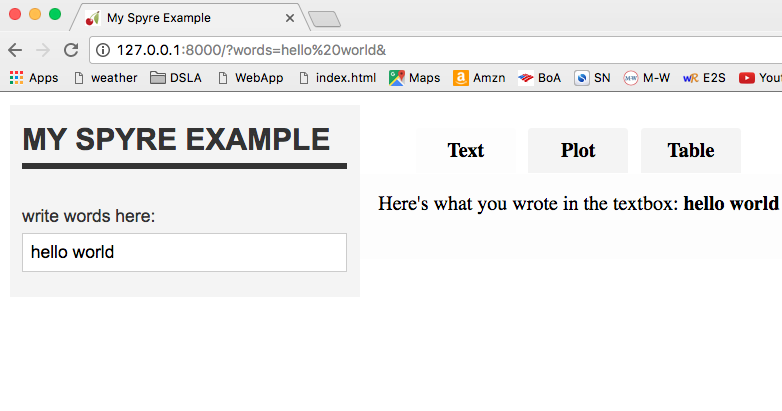
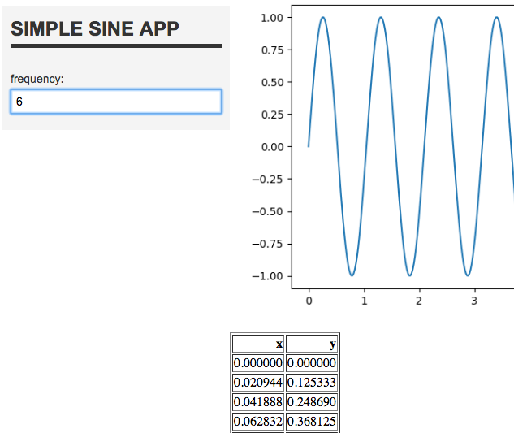
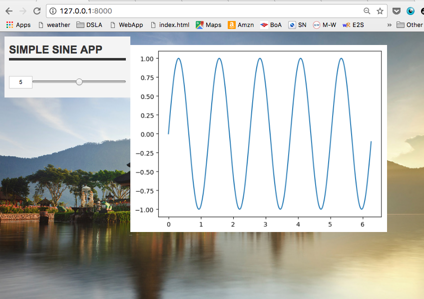
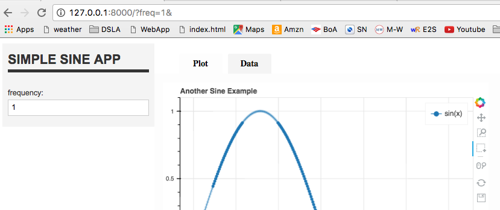
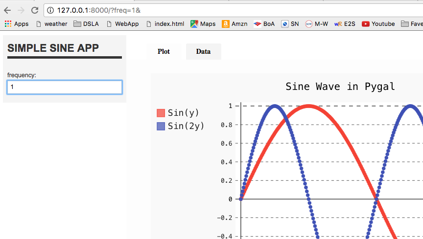
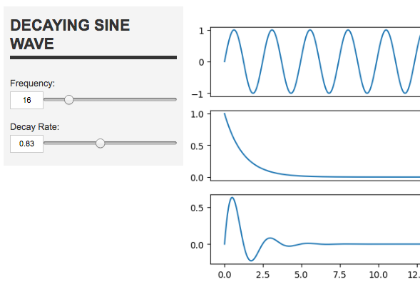

# Spyre_WebApp_Samples-DSLA
Several working samples of WebApps made using Spyre and Python3. 

For a quick introduction to how to build your Spyre app, see the developer's [readme](https://github.com/adamhajari/spyre).

## spyreSample1.py  

Textbox and output on a single page  

  

## spyreSample2.py  

Textbox, plot, and table on a single page  

## spyreSample2.1.py  

Slider, plot, and background image on a single page

## spyreSample3.py  

Textbox, Bokeh plot, and table on two tabs. You can zoom in, pan, and select parts of the plot.  

## spyreSample4.py  

Textbox, PyGal plot with two curves, and table on two tabs. Hover over points to display values.  

## spyreSample5.py  

Two sliders and three plots on a single page.  

